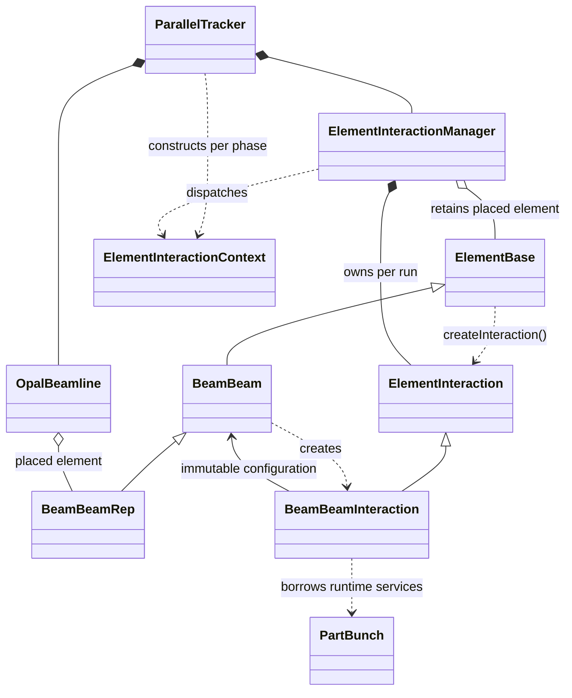

BeamBeam Summary

Physics Model

Confirmed physical objective:

- OPALX models a gamma-gamma collider. Two gamma beams collide near the
  interaction point and produce electron/positron pairs through the
  Breit-Wheeler process.
- The charged high-energy primary electron bunches are still present near the
  IP. Their collective electromagnetic fields influence the trajectories of
  the newly created, lower-energy electron/positron pairs.
- The gamma photons do not contribute a space-charge source in this model.
- The first implementation does not generate the Breit-Wheeler pairs inside
  OPALX. Their species, creation position, momentum, and individual creation
  time are imported from an external calculation such as CAIN.
- Pair creation is time-dependent. Each imported particle is emitted only when
  its own creation time is reached, at its supplied position around the IP, and
  must sample the primary-beam field during its creation step.
- The pair particles are passive witnesses because there are too few of them
  for their collective fields to matter:
  - pair charge is not deposited;
  - there is no pair self-field or electron-positron collective field;
  - the pairs do not modify either primary beam;
  - primary-beam fields do alter the pair trajectories.
- The physical primary container is both a field source and a field target. Its
  particles deposit charge and receive the collective field produced by the
  physical primary bunch and its mirrored counter-propagating counterpart. The
  opposing primary response is represented through the imposed collision
  symmetry rather than through a second independently tracked primary
  container.
- A future internal Breit-Wheeler generator should use the same time-dependent
  particle-emission interface and replace only the external pair reader.

Interaction geometry and current primary-beam approximation:

- The BeamBeam window is exactly the BeamBeam element:
  - `beginS = element begin`;
  - `endS = element end`;
  - `interactionPointS = beginS + 0.5 * element length`.
- The IP is always the element midpoint. An independent `IP_S` override is not
  part of the confirmed physical model.
- One physical primary electron bunch (`b1`) is tracked through the lattice.
- Inside the BeamBeam window, the opposing primary bunch (`b2`) is approximated
  by a same-sign mirrored copy of `b1` about the IP:
  - `z_mirror = 2 z_IP - z_actual`.
- Outside BeamBeam tracking there is no mirrored-bunch contribution.
- The intended runtime transition is:
  - before entering the BeamBeam element: normal single-bunch tracking;
  - inside the element: real primary bunch plus mirrored primary contribution
    for the field solve, with passive pair witnesses sampling that field;
  - after the primary source is retired or leaves the active window: the pair
    witnesses continue without a primary source field.
- The field-mesh model is:
  - outside BeamBeam: bunch-following in `z`;
  - inside BeamBeam: fixed in the lab / BeamBeam frame over the full element;
  - `x/y` remain bunch-following.

Known implementation gaps:

- Current BeamBeam code still accepts an `IP_S` override; midpoint geometry
  must become authoritative.
- Time-dependent file emission is already implemented by `EMITTEDFROMFILE`.
  It sorts records by their individual birth times, emits the records due in
  each tracking step, and assigns a fractional birth-step `dt`.
- `sandbox/track-e-p/gamma_gamma_pairs-3.in` exercises this intended path with
  the timed electron and positron files. The current files use the named column
  order `x y z px py pz t bin_number`, whereas `EmittedFromFile` currently
  parses the old-OPAL positional order `x px y py t pz [bin]`. In addition, the
  converter stores `t = ct/c` and an explicit creation `z`, while the reader
  applies old-OPAL pre-emission-time sign/centering semantics and does not read
  a per-record `z`. The deck therefore fails during file parsing, and the
  column mapping, time convention, and creation-position semantics must be
  reconciled.
- The newer large-cylinder decks currently use ordinary `FROMFILE` with a
  common source `T0`. After the existing timed reader/file integration is
  repaired, those physics decks must be switched to and validated with the
  per-particle `EMITTEDFROMFILE` path.

Implementation

- BeamBeam uses the element stack:
  - `BeamBeam`
  - `BeamBeamRep`
  - `OpalBeamBeam`
- Shared BeamBeam type definitions live in
  [BeamBeamDefinitions.h](src/AbsBeamline/BeamBeamDefinitions.h):
  - `BEAMBEAM::Config`
  - `BEAMBEAM::ActualGeometry`
  - `BEAMBEAM::WindowState`
  - `BEAMBEAM::Runtime`
  - `BEAMBEAM::Diagnostics`
- The runtime state machine is:
  - `Inactive`
  - `Active`
  - `Completed`
- `ElementBase::createInteraction()` is the generic factory for optional,
  stateful per-run element behavior. Ordinary local-field elements retain the
  existing `apply()` path.
- [ElementInteractionManager](src/Algorithms/ElementInteractionManager.h) owns
  the interactions created by placed elements
  and dispatches the generic `SelfField`, `AfterEmission`, and `Diagnostics`
  phases.
- [BeamBeamInteraction](src/Algorithms/BeamBeamInteraction.h) owns:
  - BeamBeam entry / exit detection
  - actual lab-frame BeamBeam geometry
  - the high-level BeamBeam state machine
  - fixed-mesh setup and restoration
  - BeamBeam self-field orchestration and witness-field gathering
  - source retirement, timing, and diagnostics state
- `ParallelTracker` owns only the generic `ElementInteractionManager`; it has no
  BeamBeam runtime state or BeamBeam-specific execution branch.
- `PartBunch` owns:
  - the fixed BeamBeam mesh handoff
  - physical and mirrored-primary deposition
  - per-bin rest-frame solves and lab-frame E/B accumulation
  - restoration of the normal co-moving field domain

Ownership and lifetime:

- `OpalBeamline` owns the placed `BeamBeamRep` clone and its immutable
  configuration for the tracking run.
- `ElementInteractionManager` retains that clone and owns one
  `BeamBeamInteraction` runtime object.
- `BeamBeamInteraction` borrows `PartBunch`, `OrbitThreader`, coordinate
  transforms, and logging services only for the duration of each generic phase
  dispatch.

Runtime Logic

- Entry detection occurs before the self-field solve of the first active BeamBeam step.
- BeamBeam activation now starts when the full bunch is inside the BeamBeam element.
- While `Active`:
  - the longitudinal mesh is fixed to the BeamBeam element in the lab frame
  - the bunch moves through that fixed mesh
  - the particle container is not periodically re-wrapped each active step
- Mirrored deposition is implemented at scatter time. The binned relativistic
  path solves the physical and copied primaries separately:
  - scatter and solve the physical primary with its measured mean momentum;
  - mirror particle `z` about the BeamBeam IP, scatter the same-sign charge,
    and restore every physical position;
  - solve the copied density with reversed longitudinal mean momentum;
  - add both E contributions and their oppositely directed B contributions.
  This separation is necessary because one combined electrostatic solve cannot
  assign opposite velocities to the two source contributions.
- The reduced high-gamma model uses `GREENSF=INTEGRATED`. Stretching the
  longitudinal mesh cell by gamma produces extremely anisotropic rest-frame
  cells; the point-cell `STANDARD` kernel overestimates the near field by
  orders of magnitude in the validated 245 MeV case.
- `BBRIGID=TRUE` removes only the BeamBeam collective E/B kick gathered to the
  physical source particles. The solved mesh field remains available to
  passive witness containers.
- Exit occurs when the first particle exits the BeamBeam element.
- After exit:
  - copying stops
  - the field-domain state from before BeamBeam is restored
  - tracking returns to the ordinary co-moving mesh

Diagnostics

- ASCII diagnostics:
  - `data/collision_ascii_frames.txt`
  - `BeamBeamWindowAnimation`
- HDF5 diagnostics:
  - [H5BeamBeamDiagnosticsWriter.h](src/Structure/H5BeamBeamDiagnosticsWriter.h)
  - [H5BeamBeamDiagnosticsWriter.cpp](src/Structure/H5BeamBeamDiagnosticsWriter.cpp)
- Current user-facing HDF states are:
  - `normal tracking`
  - `beambeam tracking`
- The HDF path writes one file per run and currently stores:
  - `rho`
  - `phi`
  - `Ex`, `Ey`, `Ez`
  - mesh origin / spacing
  - BeamBeam metadata
  - particle mean position and charge metadata

Python Tools

- [checkCollWin.py](sandbox/checkCollWin.py)
  - collision-window / BeamBeam scalar-dump viewer
- [read_beambeam_h5.py](sandbox/read_beambeam_h5.py)
  - HDF5 overview, line density, and `x,z` gallery tool
- [beam-beam-manufactured-solution.py](sandbox/beam-beam-manufactured-solution.py)
  - manufactured-solution generator and OPALX comparison tool
- [beambeam_analysis.py](sandbox/beambeam_analysis.py)
  - combined front-end with Tk GUI / browser fallback

Manufactured Solution

- The current manufactured solution is an exact symmetric 3D isotropic Gaussian pair.
- It compares OPALX against analytic:
  - `rho`
  - `phi`
- Supported manufactured-compare views include:
  - `rho+phi`
  - `rho`
  - `phi`
  - `rho-z-axis`
  - `phi-z-axis`
- Movie mode uses fixed axes across the selected range.

Current Design Choices

- The BeamBeam window is the BeamBeam element.
- The IP remains the midpoint of that element.
- The raw HDF schema still stores internal snapshot kinds, but user-facing tools map them to:
  - `normal tracking`
  - `beambeam tracking`
- `read_beambeam_h5.py` remains part of the workflow and is not replaced by the combined GUI.
