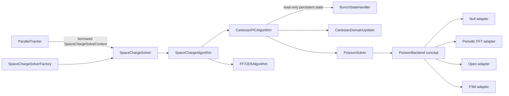

# Space-Charge Architecture

`SpaceChargeSolver` is the stable tracker-facing orchestrator. It validates immutable configuration,
particle binding identity, per-step requests, and bunch-wide fixed-domain state before dispatching a
compiled-in `SpaceChargeAlgorithm`.

## Algorithm Extension

A meshless or tree-based implementation derives directly from `SpaceChargeAlgorithm`. Adding a
compiled-in algorithm requires:

1. A parser-independent configuration alternative in `SpaceChargeAlgorithmConfig`.
2. Parser/configuration mapping in `SpaceChargeConfigBuilder`.
3. Construction registration in `SpaceChargeSolverFactory`.
4. Capability reporting and focused validation/tests.

The tracker and `SpaceChargeSolveContext` remain unchanged after registration. Context data is
borrowed for one call, and device views must be reacquired after any migration or layout change.

## Cartesian PIC

The Cartesian path transforms the primary container to the solve frame, updates the mesh, runs
ordered correction/deposition/Poisson/gather passes, restores primary R/E/B, then normally rebuilds
a reference-frame domain after migrating all containers. Fixed Cartesian bounds are persistent
bunch-wide state in `BunchStateHandler`; they are read directly by Cartesian PIC rather than copied
through the tracker context or immutable domain configuration.

Fixed mode currently requires OPEN with no correction or ORB. It accepts binning, uses exact supplied
solve-frame bounds, migrates only the primary container, skips emission stretching, and preserves the
beam-frame mesh after the solve. Clearing the state restores domain-following behavior on the next
Cartesian solve.

## Poisson Extension

`PoissonSolver` owns a private variant of adapters satisfying the C++20 `PoissonBackend` concept.
Each adapter owns one concrete IPPL backend and centralizes its name, capabilities, coupling
constant, parameter construction, RHS-before-LHS binding, and solve behavior. To add a compatible
grid backend:

1. Add parser/config enum mapping.
2. Implement and compile-check one adapter.
3. Append it to the private backend variant.
4. Add one case to `PoissonSolver::constructBackend()`.
5. Add focused construction, metadata, rebuild, and solve tests.

CG remains recognized and rejected early. Its potential field storage and layout-refresh support are
reserved until scalar-LHS and gradient-output bindings are implemented together.

## Failure Policy

Space-charge exceptions terminate the current run. Successful paths restore temporary Green
functions, particle charge/time-step transforms, mesh spacing, and coordinate frames in their
established order. No rollback is attempted after a thrown backend, kernel, migration, or transform,
and transient state is unspecified after failure.
