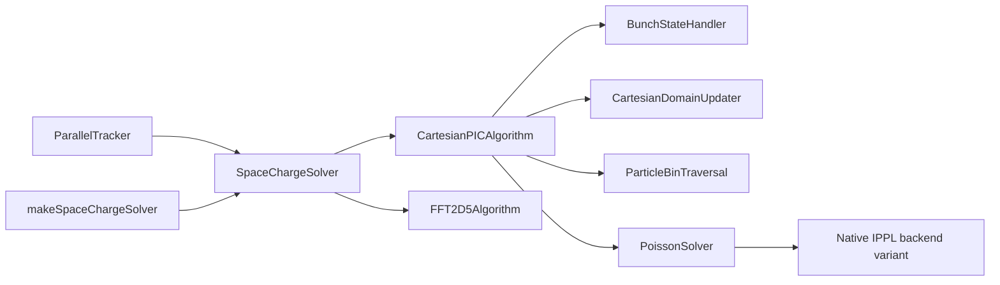

# Space-Charge Architecture

`SpaceChargeSolver` is the tracker-facing owner of one compiled-in `SpaceChargeAlgorithm`. The
tracker supplies only step state and per-container activity; concrete algorithms borrow stable
particle containers at construction and reacquire Kokkos views after migration.

## Extension Points

A new independent algorithm adds a `SpaceChargeConfig` alternative, parser conversion in
`buildSpaceChargeConfig()`, construction in `makeSpaceChargeSolver()`, and a
`SpaceChargeAlgorithm` implementation. Meshless and tree algorithms belong at this boundary rather
than in Cartesian PIC or `PoissonSolver`.

`PoissonSolver` is a closed, host-only variant over native IPPL backends. A grid backend adds one
variant alternative, construction case, metadata case, parser mapping, and focused tests. Backend
objects are fully constructed before RHS/LHS binding because `setRhs()` initializes CUDA and FFT
resources. CG remains recognized and rejected; potential storage and layout refresh are reserved for
its future implementation.

## Cartesian PIC

Cartesian PIC transforms and solves only the primary container in the beam frame. The reference
phase restores a shared tracker-frame domain and migrates all containers. Domain geometry, particle
migration, ORB, and Poisson reconstruction ordering live together in `CartesianDomainUpdater`.
Adaptive binning remains isolated behind `ParticleBinTraversal`.

Fixed Cartesian bounds are persistent bunch-wide state. Fixed mode requires OPEN with no correction
or ORB, keeps configured extents and decomposition, disables emission stretching, migrates only the
primary container, and retains the beam-frame mesh until the state is cleared.

## Failure Policy

Successful paths restore temporary Green functions, image transforms, time-step scaling, mesh
spacing, and coordinate frames in their established order. Exceptions terminate the run; transient
particle, field, mesh, frame, and backend state is unspecified after failure.
